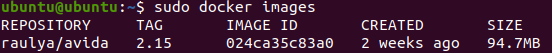

# Ejecutar avida en un contenedor de Docker

## Instalar Docker en ubuntu 20.04

- https://www.digitalocean.com/community/tutorials/how-to-install-and-use-docker-on-ubuntu-20-04-es

## Instalar Docker en Windows 10

- https://www.youtube.com/watch?v=9awV3Y-rpI0


## avida pre-compilado en una imagen existente

Descargar imagen

```
docker pull raulya/avida:2.15
```

Comprobar que se ha descargado:

```
docker images
```



Ejecutar el contenedor y abrir sesión

```
docker ru -it raulya/avida:2.15 /bin/sh
```

