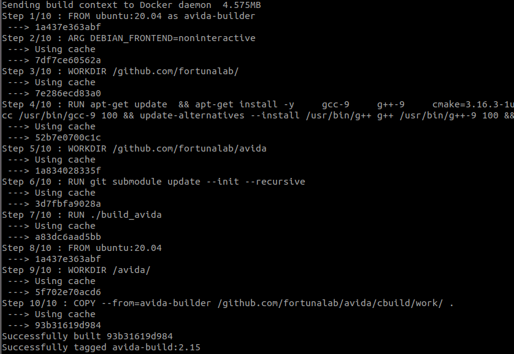

# Ejecutar avida en un contenedor de Docker

## Instalar Docker en ubuntu 20.04

- https://www.digitalocean.com/community/tutorials/how-to-install-and-use-docker-on-ubuntu-20-04-es

## Instalar Docker en Windows 10

- https://www.youtube.com/watch?v=9awV3Y-rpI0


## avida pre-compilado en una imagen existente

Descargar imagen

```
sudo docker pull raulya/avida:2.15
```

Comprobar que se ha descargado:

```
sudo docker images
```


Ejecutar el contenedor y abrir sesión

```
docker ru -it raulya/avida:2.15 /bin/bash
```

Ejecutar avida

```
cd avida/
./avida -version
```

El resultado debe ser:

    ```
    Avida 2.15.0
    --------------------------------------------------------------------------------
    by Charles Ofria
    Lead Developer: David M. Bryson

    Active developers include:
    Aaron P. Wagner and Anya E. Johnson
    For a more complete list of contributors, see the AUTHORS file.

    Copyright 1999-2014 Michigan State University.
    Copyright 1993-2003 California Institute of Technology.

    Avida comes with ABSOLUTELY NO WARRANTY.
    This is free software, and you are welcome to redistribute it under certain
    conditions. See file COPYING for details.

    For more information, see: http://avida.devosoft.org/
    --------------------------------------------------------------------------------
    ```
    
## Crear una imagen con avida compilado

Creamos con el editor preferido un archivo llamado *Dockerfile* con el siguiente contenido:

    ```
    FROM ubuntu:20.04 as avida-builder
    ARG DEBIAN_FRONTEND=noninteractive
    WORKDIR /github.com/fortunalab/
    RUN apt-get update  && apt-get install -y \
        gcc-9 \
        g++-9 \
        cmake=3.16.3-1ubuntu1 \
        make=4.2.1-1.2 \
        git=1:2.25.1-1ubuntu3.4 \
        curl \
    && update-alternatives --install /usr/bin/gcc gcc /usr/bin/gcc-9 100 \
    && update-alternatives --install /usr/bin/g++ g++ /usr/bin/g++-9 100 \ 
    && git clone https://github.com/fortunalab/avida.git
    WORKDIR /github.com/fortunalab/avida
    RUN git submodule update --init --recursive
    RUN ./build_avida

    FROM ubuntu:20.04
    WORKDIR /avida/
    COPY --from=avida-builder /github.com/fortunalab/avida/cbuild/work/ .
```

Compilamos la imagen:

```
docker build -t avida-build:2.15
```




Ejecutar contenedor:

```
docker run -it avida-build:2.15 /bin/bash
```

Una vez dentro nos situamos en la carpeta /avida

```
cd /avida
```

Y ejecutamos avida:

```
./avida
```
