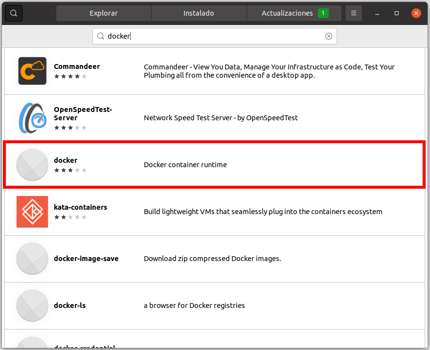
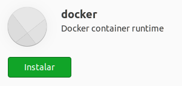
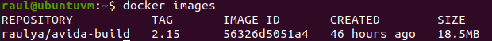

# Instala Docker en Ubuntu

1. Ejecutar Ubuntu Software


1. Buscar "docker"



1. Clic en el paquete **docker runtime**

1. Clic en **Instalar**



1. Ejecutar docker como un usuario normal

Docker por defecto es únicamente accesible con privilegios de root, para poder usar los comandos como un usaurio normal ejecutar lo siguiente:

  Crear el grupo docker

  ```
  sudo addgroup --system docker
  ```
  
  Añadir el usuario al grupo docker

  ```
  sudo adduser $USER docker
  ```
  
  Cambiar GID

  ```
  newgrp docker
  ```

  Deshabilitar servicio docker
  
  ```
  sudo snap disable docker
  ```
  
  Habilitar el servicio docker
  
  ```
  sudo snap enable docker
  ```

  A partir de aquí ya podemos usar los comandos docker sin tener que indicar sudo.
  
  Por ejemplo, descargamos una imagen con avida isntalada:
  
  ```
  docker pull raulya/avida-build:2.15
  ```
  
  Y a continuacion listamos las imaǵenes que tenemos descargadas:
  
  ```
  docker images
  ```
  
  El resultado debería ser:
  
  
