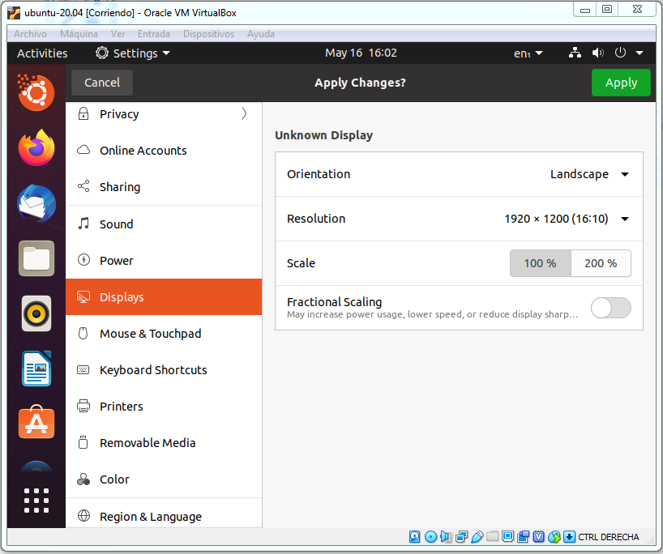
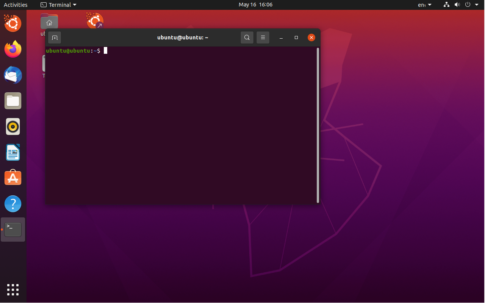
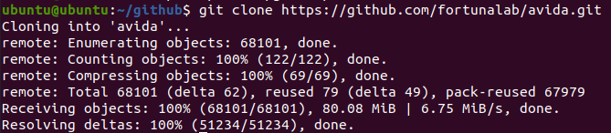
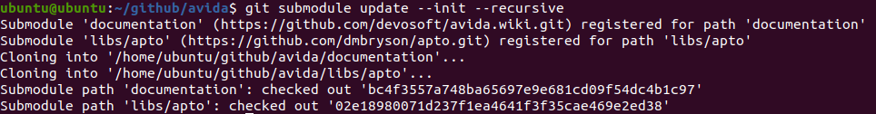
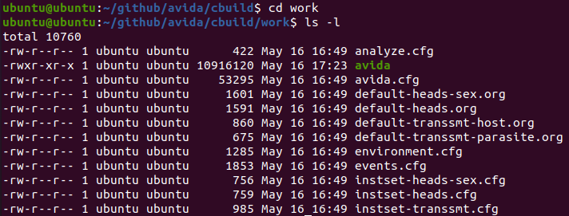
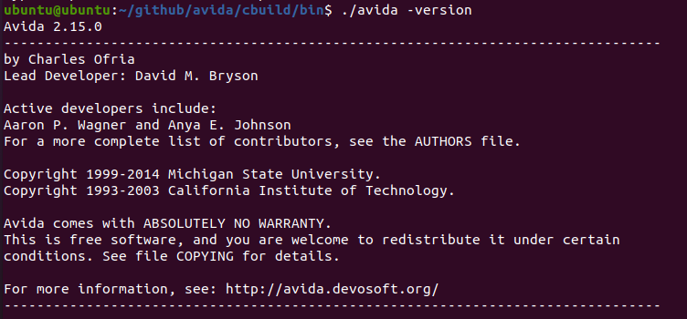

1. Descargar e **Instalar Virtual Box**

    - https://www.virtualbox.org

    

1. **Ejecutar Virtual Box**
    
1. Menú Máquina > **Nueva** (o bien CTRL + D)

   

1. Nombre: ubuntu-20.04

   - Tipo: **Linux**
   - Versión: **Ubuntu (64-bit)**
   - Tamaño de memoria: **4098** (requisito de Docker)
   - Crear un disco virtual ahora: Seleccionado

   
   
   Click en botón **Crear**
   
   
   
   Click en botón **Crear**
   
   
1. **Descargar** imagen **Ubuntu Desktop 20.04**

   - https://ubuntu.com/download/desktop
   
   

   
1. VirtuaBox
   Configuración > Almacenamiento > Controlador IDE > Vacio >
   **Seleccione Archivo de Disco Virtual**
   
   
   
   **Marcar CD/DVD Vivo (Live)**
   
   
   
   
1. **Iniciar** Máquina Virtual (**Inicio desacoplado**).

   

1. **Instalar Ubuntu** (Install Ubuntu)

   

   - Selecciona Idioma y Teclado
   - Erase disk > Intall Now > Continue
   - Zona Horaria
   - Nombre de usuario, máquina y contraseña
   
   
   
   
   
   Esperamos unos minutos hasta finalizar la instalación
      
   
   
   **Reiniciar** (Restart Now)
   
   
   
1. VirtualBox > Configuración > **Eliminar Disco Virtual**

   
   
   Presionar **Enter**
   
1. Cambiar **Resolución de Pantalla**

   Click botón derecho sobre el escritorio
   
   Settings > Display > Resolution
   
   Elegir resolución deseada (ejemplo 1280 x 800).
   
   
   
   Clic en **Apply** (Aplicar)

1. Abrimos una **terminal** (CTRL + T)


   
   
   
1. **Instalar herramientas**

    Actualizar fuentes

    ```
    sudo apt-get update
    ```
    
    Instalar paquetes
    
    ```
    sudo apt-get -y install ca-certificates gcc-9 g++-9 make=4.2.1-1.2 cmake=3.16.3-1ubuntu1  git=1:2.25.1-1ubuntu3.4 curl
    ```
    
1.  Clonar repositorio avida

    Crear directorio
    
    ```
    mkdir /home/mi_usuario/github
    ```

    Saltar al directorio
    
    ```
    cd /home/mi_usuario/github
    ```
    
    Clonar avida
    
    ```
    git clone https://github.com/fortunalab/avida.git
    ```
    
    
    
    Saltar a directorio avida
    
    ```
    cd avida/
    ```
    
    Actualizar submódulos
    
    ```
    git submodule update --init --recursive
    ```
    
    
    
1.  **Compilar avida**

    Compilamos avida ejecutando el script build-avida
    
    ```
    ./build_avida
    ```
    
    El comando anterior puede dar un error debido a que usa 10 hilos para la compilación.
    Para solucionarlo podemos ejecutar los siguientes comandos
    
    ```
    cd /home/ubuntu/github/avida
    rm -R cbuild/
    mkdir -p cbuild
    cd cbuild
    cmake ../
    make
    make install
    ```
    
    
1.  **Ejecutar avida**

    Los archivos finales son creados en cbuild/work/bin
    
    ```
    cd work
    ```
    
    Listamos archivos
    
    ```
    ls -l
    ```
    
    
    
    
    Comprobamos número de versión
    
    ```
    ./avida -version
    ```    
    
    
    
