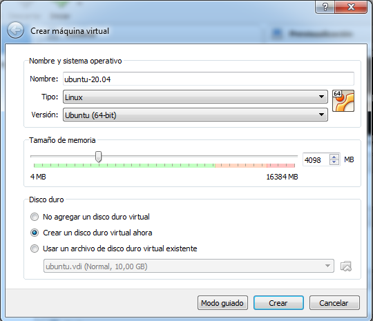

## Instalar Ubuntu sobre VirtualBox

1. Descargar e **Instalar Virtual Box**

    - https://www.virtualbox.org

    

1. **Ejecutar Virtual Box**
    
1. Menú Máquina > **Nueva** (o bien CTRL + D)

   

1. Nombre: ubuntu-20.04

   - Tipo: **Linux**
   - Versión: **Ubuntu (64-bit)**
   - Tamaño de memoria: **4098** (requisito de Docker)
   - Crear un disco virtual ahora: Seleccionado

   
   
   Click en botón **Crear**
   
   
   
   Click en botón **Crear**
   
   
1. **Descargar** imagen **Ubuntu Desktop 20.04**

   - https://ubuntu.com/download/desktop
   
   

   
1. VirtuaBox
   Configuración > Almacenamiento > Controlador IDE > Vacio >
   **Seleccione Archivo de Disco Virtual**
   
   
   
   **Marcar CD/DVD Vivo (Live)**
   
   
   
   
1. **Iniciar** Máquina Virtual (**Inicio desacoplado**).

   

1. **Instalar Ubuntu** (Install Ubuntu)

   

   - Selecciona Idioma y Teclado
   - Erase disk > Intall Now > Continue
   - Zona Horaria
   - Nombre de usuario, máquina y contraseña
   
   
   
   
   
   Esperamos unos minutos hasta finalizar la instalación
      
   
   
   **Reiniciar** (Restart Now)
   
   
   
1. VirtualBox > Configuración > **Eliminar Disco Virtual**

   
   
   Presionar **Enter**

1. Abrimos una terminal (CTRL + T)
   
   
